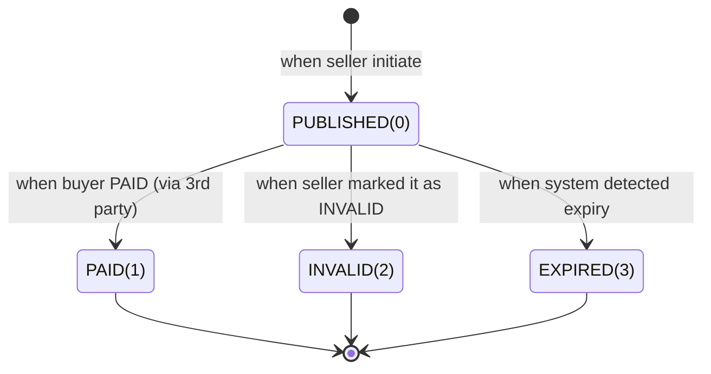

# purchase platform (mini)

## States

### Product / Individual items

stateDiagram-v2
    [*] --> AVAILABLE(0): when product is added
    AVAILABLE(0) --> OFFERED(1): when product offered / locked for payment
    OFFERED(1) --> AVAILABLE(0): when product becomes available again
    OFFERED(1) --> SOLD(2): when sold
    SOLD(2) --> [*]

### Invoice

1. Published
2. Paid
3. Expired
4. Invalid

